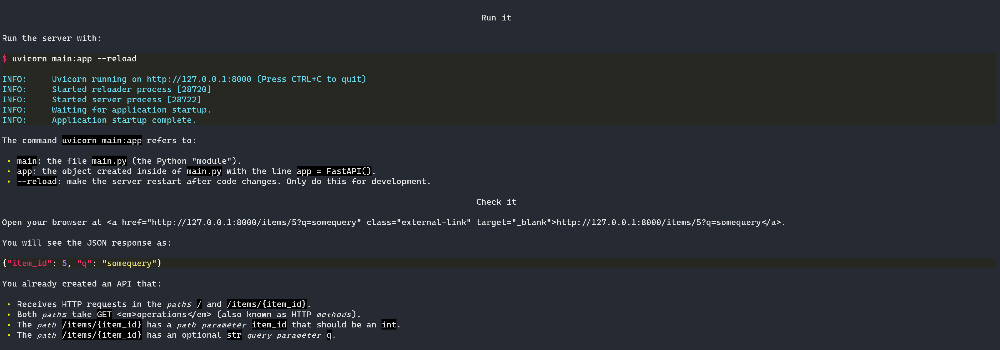

# Hatch v1.6.0

Hatch [v1.6.0](https://github.com/pypa/hatch/releases/tag/hatch-v1.6.0) brings improvements to build environments, better handling of dynamic metadata, and support for tools like Visual Studio Code.

<!-- more -->

## Build environments

Originally, the environment interface method for [providing builder sub-environments](../../plugins/environment/reference.md#hatch.env.plugin.interface.EnvironmentInterface.build_environment) was intended to be used in conjunction with some cleanup logic in order to provide a fresh setup every time. However, this is unnecessary in practice because build dependencies rarely change.

Without caching, repeat build environment use is slow which affects the following scenarios:

- the [`build`](../../cli/reference.md#hatch-build) command
- commands that read project metadata, like [`dep hash`](../../cli/reference.md#hatch-dep-hash), if any fields are [set dynamically](../../config/metadata.md#dynamic)

Now a new environment interface method [`build_environment_exists`](../../plugins/environment/reference.md#hatch.env.plugin.interface.EnvironmentInterface.build_environment_exists) is used by Hatch to determine whether or not it has already been created, for implementations that have a caching mechanism.

The [`virtual`](../../plugins/environment/virtual.md) environment type now uses this method to cache build environments.

## Project metadata

Dynamically defined metadata is now supported everywhere, thanks to the new caching of `virtual` build environments.

A [`project metadata`](../../cli/reference.md#hatch-project-metadata) command is introduced that displays the fully resolved [metadata](../../config/metadata.md). The output format is JSON unless a field is specified as an argument.

For example, if you checkout a project that is built by Hatch, like [FastAPI](https://github.com/tiangolo/fastapi), and run:

```
hatch project metadata readme
```

only the `readme` text will be displayed. If the content is in Markdown, then [Rich](https://github.com/Textualize/rich) will render it directly in your terminal:

{ loading=lazy }

## Virtual environment location

The [`virtual`](../../plugins/environment/virtual.md) environment type now uses a flat layout for storage in the configured `virtual` [environment directory](../../config/hatch.md#environments) if the directory resides somewhere within the project root or if it is set to a `.virtualenvs` directory within the user's home directory.

For example, if you define the following Hatch configuration:

=== ":octicons-file-code-16: config.toml"

    ```toml
    [dirs.env]
    virtual = ".hatch"
    ```

and the following [matrix](../../config/environment/advanced.md#matrix):

=== ":octicons-file-code-16: pyproject.toml"

    ```toml
    [[tool.hatch.envs.test.matrix]]
    python = ["37", "38", "39", "310", "311"]
    ```

=== ":octicons-file-code-16: hatch.toml"

    ```toml
    [[envs.test.matrix]]
    python = ["37", "38", "39", "310", "311"]
    ```

then [locating](../../cli/reference.md#hatch-env-find) environments with the following command:

```
hatch env find test
```

will show that the general directory structure is:

```
.hatch
├── test.py37
├── test.py38
├── test.py39
├── test.py310
└── test.py311
```

This flat structure is required for detection of virtual environments by tools like Visual Studio Code and PyCharm.

Additionally, the `virtual` environment type now supports a `path` option to specify an explicit path that all [inherited](../../config/environment/overview.md#inheritance) environments will share, such as the common `.venv`.

## Migration script improvements

The [script](https://github.com/pypa/hatch/blob/hatch-v1.6.0/src/hatch/cli/new/migrate.py) used to migrate [existing projects](../../intro.md#existing-project) from `setuptools` has been improved to handle more edge cases that were encountered in the wild and now no longer modifies the formatting of existing `pyproject.toml` configuration.

## Hatchling

Hatch now depends on Hatchling [v1.11.0](https://github.com/pypa/hatch/releases/tag/hatchling-v1.11.0), which was also just released.

### Environment version source

A new [`env` version source](../../plugins/version-source/env.md) is available that allows for the project version to be defined by an environment variable.

### Relaxed version bumping

The [`standard` version scheme](../../plugins/version-scheme/standard.md) now supports a `validate-bump` option that when set to `false` will forego the check when [updating the version](../../version.md#updating) that the desired version is higher than the current version.

This use case comes from [Project Jupyter](https://jupyter.org):

> A common pattern we use in Jupyter is to bump to a `.dev0` minor version bump after making a release.  If we have a  bug fix that needs to go out in the interim, we'd rather not be forced to create a branch every time.
