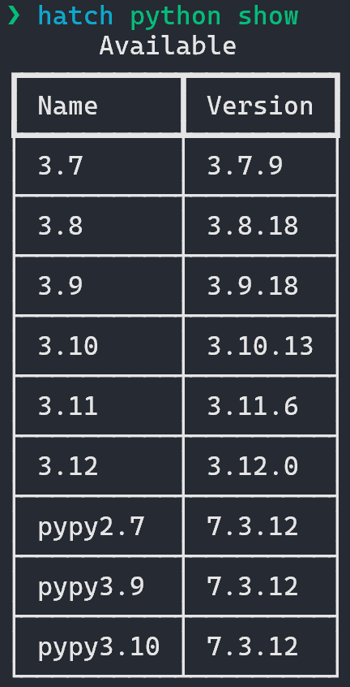

# Hatch v1.8.0

Hatch [v1.8.0](../../history/hatch.md#hatch-v1.8.0) brings Python distribution management, static analysis and formatting backed by Ruff, and binaries for every platform.

<!-- more -->

## Installation made easy

One thing that has been a perpetual problem for Hatch and other Python applications is that Python itself is a dependency. You, and more importantly your users, need to in some way get Python before your software can even be used. The recommended way to go about that is platform-dependent and even differs based on your target audience. I viewed this as a central UX problem for Hatch and so severe that I took a bit of a hiatus to solve it.

Luckily, I have to my satisfaction solved this problem in the form of [PyApp](https://github.com/ofek/pyapp). It is a runtime installer for Python projects written in Rust. Apps are distributed as standalone executables as users have come to expect and bootstrapping occurs upon the first invocation. Here is an example of what you would see the first time you run a binary from this release:

<figure markdown>
  { loading=lazy role="img" }
</figure>

Now that we have binaries, creating installers for different platforms becomes trivial. Starting with this release not only are binaries available for every platform but also we have installers for Windows and macOS. The installer for macOS is signed using a certificate from the same account used to sign the official distributions from https://www.python.org, so users will not get any security pop-ups. Shout out to @ewdurbin for their extreme generosity in setting up multiple certificates in their free time!

These installers and binaries are now the [recommended way](../../install.md) to install and update Hatch. These binaries have built-in management so you can update to the latest version by running `hatch self update`.

!!! note "Windows signing"
    In future we will sign the installers for Windows but I did not have time to look into how that works. macOS signing took way longer than I anticipated :sweat_smile:

## Python management

For a long time I and other users have desired that Hatch gain the ability to manage Python distributions. In my mind this was always blocked on a better installation experience because there was sort of a chicken-or-egg problem where you want a Python manager but you first need Python. No longer is that the case!

The new [`python`](../../cli/reference.md#hatch-python) command group allows for easy installation of various distributions to arbitrary locations (default `~/.pythons`) which are then added to your PATH by default. Hatch supports CPython and PyPy distributions:

<figure markdown>
  { loading=lazy width="200" role="img" }
</figure>

## Virtual environment Python resolution

The `virtual` environment type is now far more intelligent when resolving the parent distribution to use and guarantees that, when no specific version is requested, the resolved distribution will always be [compatible](../../config/metadata.md#python-support) with the project.

Additionally, when a requested version cannot be found on PATH it will [automatically](../../plugins/environment/virtual.md#python-resolution) be downloaded and managed internally.

## Static analysis

There is a new [`fmt`](../../cli/reference.md#hatch-fmt) command, backed entirely by [Ruff](https://github.com/astral-sh/ruff), that checks and fixes your code for formatting and linting issues.

Starting with this release, Hatch maintains [default settings](../../config/static-analysis.md#default-settings) that are guaranteed to be up-to-date and represent best practices for programming in modern Python. The idea is to provide defaults that are so broadly applicable that the majority of users will maintain little if any of their own [overrides](../../config/static-analysis.md#extending-config).

The default behavior is internal management of settings to provide an OOTB experience that works. It is recommended however that you [persist](../../config/static-analysis.md#persistent-config) the default config file in version control so that other tools like IDEs can utilize your full configuration.

Since Ruff is now provided as a built-in feature, new project templates no longer have such configuration and are much less verbose.

## Build improvements

[Building](../../cli/reference.md#hatch-build) projects that do not use Hatchling as a backend is now supported and such builds are managed with the standard [build](https://github.com/pypa/build) tool.

The bridge between Hatch and the Hatchling CLI has been removed. Previously, the builder would send serialized messages to Hatch that would contain the desired content and style for each line of output. This was done in an effort to allow builder and build hook plugins to output pretty messages without actually requiring a dependency like [Rich](https://github.com/Textualize/rich). A problem that arises with this is that builders that invoke subprocesses will not display ANSI codes as one might expect and will lose out on the interactive experience of such invocations, like the built-in [app builder plugin](../../plugins/builder/app.md) calling `cargo build`. So now everything is simpler at the expense of no colored output without manual logic, or adding a dependency if you're a third-party plugin.

## Faster environment usage

[Spawning a shell](../../environment.md#entering-environments) or [running commands](../../environment.md#command-execution) within environments always first checks that your project's dependencies are satisfied and if not synchronizes the environment with what is defined. Previously, this had the potential to be quite slow for projects that have many dependencies.

Now the set of dependency definitions is [hashed](../../plugins/environment/reference.md#hatch.env.plugin.interface.EnvironmentInterface.dependency_hash) and no check is performed if the hash is the same as before, significantly speeding up environment usage in most cases.

## Hatchling

Hatch now depends on Hatchling [v1.19.0](https://github.com/pypa/hatch/releases/tag/hatchling-v1.19.0), which was also just released.

### Better defaults

Hatchling is all about providing the best possible defaults, even at the expense of backward compatibility. In this release, there are two breaking changes that provide a much better user experience and were in fact requested by users.

- Both the [`force-include`](../../config/build.md#forced-inclusion) option and the [`force_include_editable`](../../plugins/builder/wheel.md#build-data) wheel build data setting now raise errors if source paths do not exist.
- The `wheel` build target now raises an error when no file inclusion options have been defined and none of its [heuristics](../../plugins/builder/wheel.md#default-file-selection) to determine what to ship are satisfied.

### App build target

A new [`app`](../../plugins/builder/app.md) build target is now stable that allows for the building of standalone binaries for projects. This is what Hatch itself uses for its binaries.

## Meta

### Why Hatch?

A [new page](../../why.md) has been introduced that discusses the value proposition of Hatch and Hatchling in comparison to alternatives. Currently, it only addresses a few features but in future this page will become more comprehensive.

### Future

Upcoming features include a `test` command, commands to manage dependencies, and workspaces functionality [similar to Cargo](https://doc.rust-lang.org/book/ch14-03-cargo-workspaces.html) that will make managing monorepos far easier.

Next year there will be two large efforts that you should expect to see:

1. A significant amount of my free time (and some at work) will be devoted to introducing lock file functionality in Hatch and trying to get whatever that happens to be standardized.

    I met with @brettcannon about his thoughts post-[PEP 665](https://peps.python.org/pep-0665/) and about [mousebender](https://github.com/brettcannon/mousebender). I also met with the [prefix.dev](https://github.com/prefix-dev) team about [rip](https://github.com/prefix-dev/rip) and was fortunate enough to be shown a demo before its official announcement.

    At the moment, the two options I see are to either go all in and contribute to mousebender or rely on the Prefix folks and use rip. The latter has the benefit of _potentially_ supporting Conda as a side effect with the downside of being quite new with the spec firmly out of our control. The former has the benefit of being able to easily gain institutional support from the Python packaging team and each of our employers with the downside being a significant amount of work needing to be done.

1. When @henryiii is able to get some free time away from teaching I plan to work with him once again and push very hard for the Python build ecosystem to adopt the [extensionlib](https://github.com/ofek/extensionlib) approach.

    I am of the opinion that the Python community has not fully completed the expressed outcome of [PEP 517][] in that build backends are still (for the most part) reliant on setuptools for building non-Python code bases.

    Basically, there are components that interact with compilers to produce extension modules and components that pack files into an archive which we call a build backend. These are two distinct pieces of functionality and my view is that there should be an API that allows backends to consume extension module builders to find out where things got created and where they should be shipped inside archives.

    In this hypothetical future any build backend would be able to trigger the building of extension modules based on user configuration.

### Support

If you or your organization finds value in what Hatch provides, consider a [sponsorship](https://github.com/sponsors/ofek) to assist with maintenance and more rapid development!
