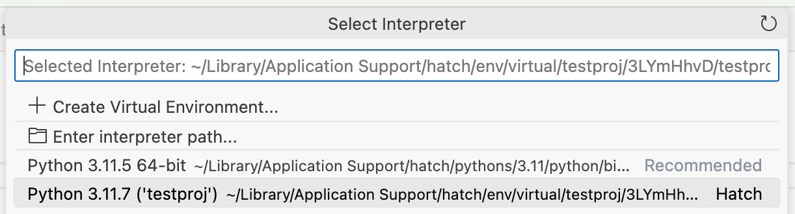
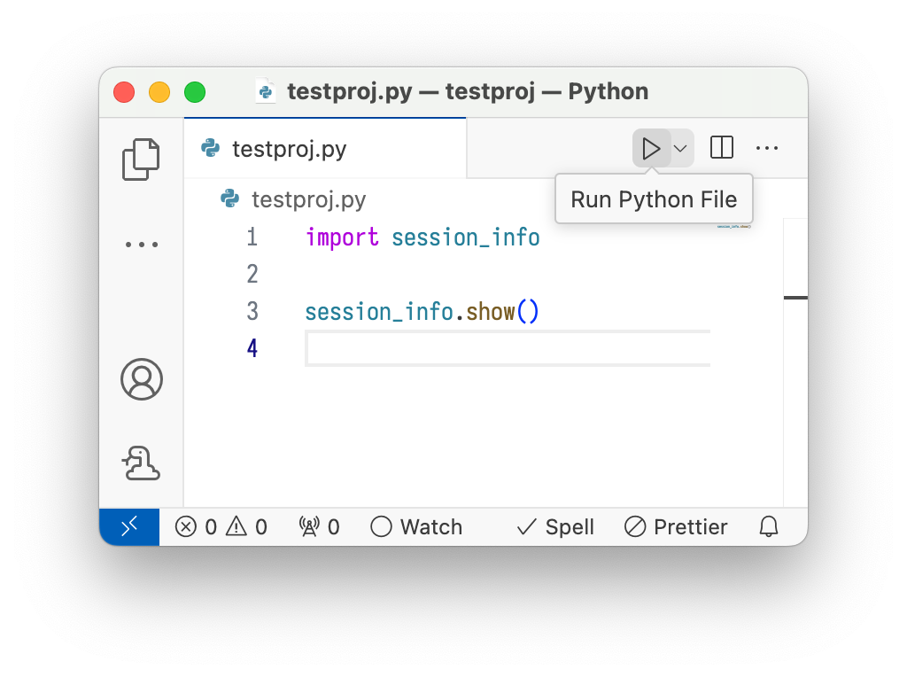

# How to use Hatch environments from Visual Studio Code

-----

Visual Studio Code announced support for [Hatch environment discovery](https://code.visualstudio.com/updates/v1_88#_hatch-environment-discovery) in `vscode-python`'s [2024.4 release](https://github.com/microsoft/vscode-python/releases/tag/v2024.4.0).

For it to work, you should [install Hatch](../../install.md) globally. If you used the GUI installers on Windows or macOS, or your system package manager on e.g. Arch Linux or Fedora, this should be taken care of.

??? note "Setting up PATH"

    If you installed Hatch with [pipx](../../install.md#pipx) rather than system-wide, you might need to add `$HOME/.local/bin` to your PATH environment variable *for your graphical session*, not just your terminal. Check like this:

    ```console
    $ pgrep bin/code  # or some other graphical application
    1234
    $ cat /proc/1234/environ | tr '\0' '\n' | grep -E '^PATH='
    PATH=/usr/local/sbin:/usr/local/bin:/usr/sbin:/usr/bin:/sbin:/bin
    ```

    If the directory is not in there, you need to add it in your session startup script, in a way that depends on your desktop environment:

    - [KDE Plasma](https://userbase.kde.org/Session_Environment_Variables)
    - [GNOME](https://help.ubuntu.com/community/EnvironmentVariables#Session-wide_environment_variables)

## Project setup

1. Make Hatch install the project and its dependencies to an environment using the [`env create`](../../cli/reference.md#hatch-env-create) command.

2. Select an interpreter using the ++"Python: Select Interpreter"++ command:

     <figure markdown>
         { loading=lazy role="img" }
     </figure>

3. You should now be able to use the environment. For example, if you have the `python.terminal.activateEnvironment` setting set to `true` and you open a new terminal, the environment should be activated. Alternatively, you could press the "play" button to run a file in the environment:

     <figure markdown>
         { loading=lazy role="img" }
     </figure>
